<!-- Generated from profile.json and verified public GitHub data. -->

  <picture><source media="(prefers-color-scheme: dark)" srcset="assets/dark/header.svg">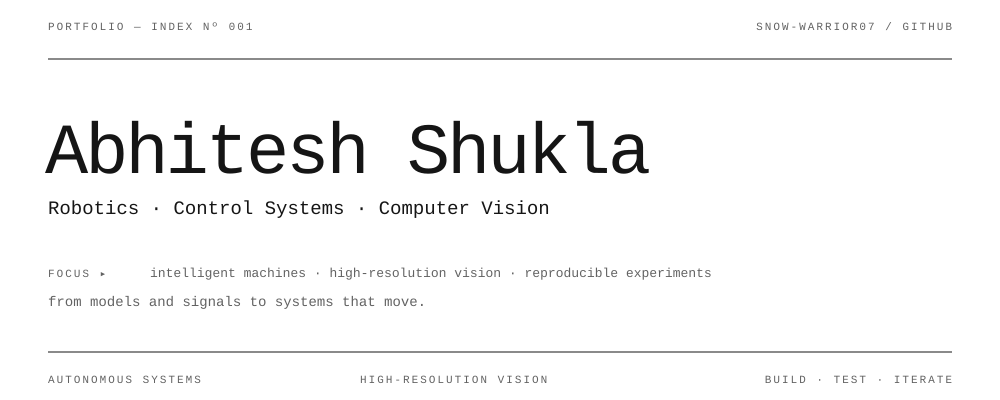</picture>
  <a href="https://github.com/Snow-Warrior07"><picture><source media="(prefers-color-scheme: dark)" srcset="assets/dark/link-github.svg">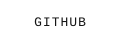</picture></a>
  <a href="https://github.com/Snow-Warrior07?tab=repositories"><picture><source media="(prefers-color-scheme: dark)" srcset="assets/dark/link-projects.svg"></picture></a>
  <a href="https://github.com/Snow-Warrior07?tab=overview"><picture><source media="(prefers-color-scheme: dark)" srcset="assets/dark/link-activity.svg"></picture></a>

<picture><source media="(prefers-color-scheme: dark)" srcset="assets/dark/s01.svg">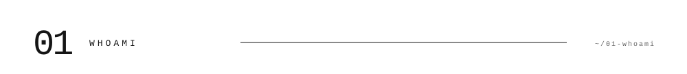</picture>
<picture><source media="(prefers-color-scheme: dark)" srcset="assets/dark/whoami.svg">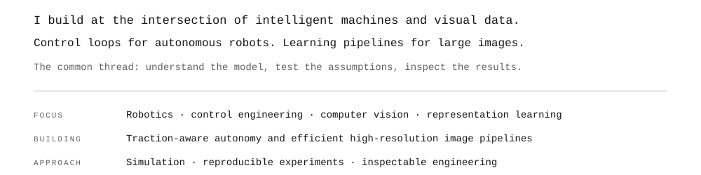</picture>

<picture><source media="(prefers-color-scheme: dark)" srcset="assets/dark/s02.svg">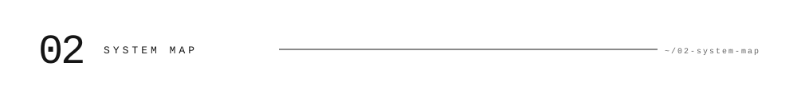</picture>
<picture><source media="(prefers-color-scheme: dark)" srcset="assets/dark/ecosystem.svg">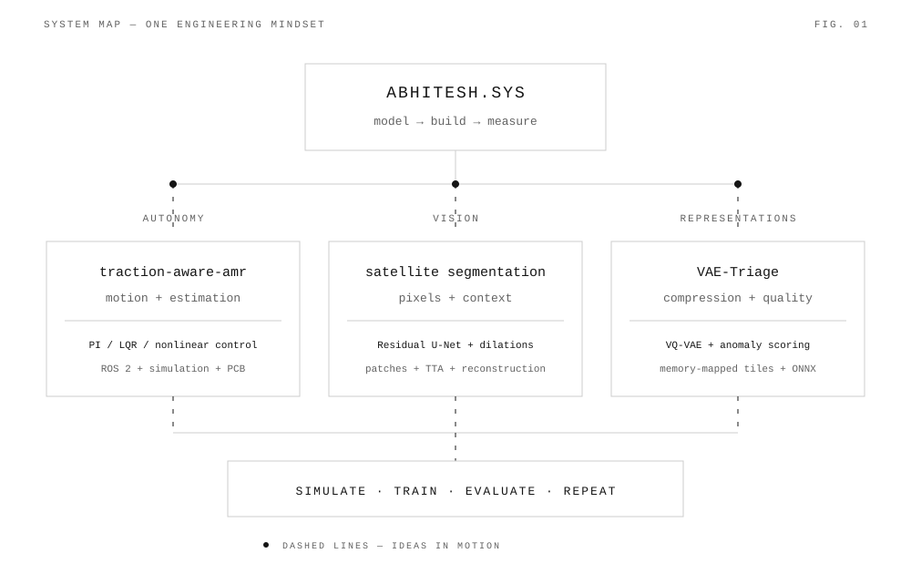</picture>

<picture><source media="(prefers-color-scheme: dark)" srcset="assets/dark/s03.svg">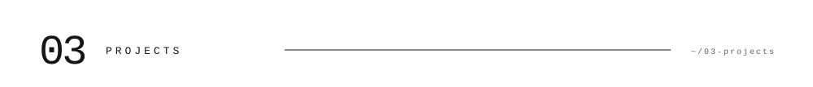</picture>
<a href="https://github.com/Snow-Warrior07/traction-aware-amr"><picture><source media="(prefers-color-scheme: dark)" srcset="assets/dark/project-01.svg">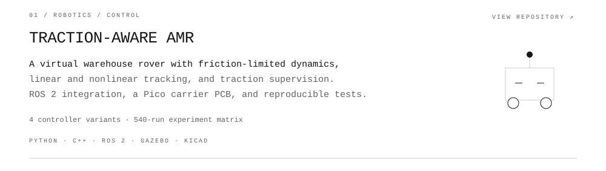</picture></a>

<a href="https://github.com/Snow-Warrior07/Satellite_based_tile_segmentation"><picture><source media="(prefers-color-scheme: dark)" srcset="assets/dark/project-02.svg">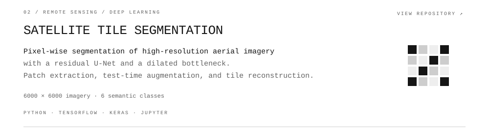</picture></a>

<a href="https://github.com/Snow-Warrior07/VAE-Triage"><picture><source media="(prefers-color-scheme: dark)" srcset="assets/dark/project-03.svg">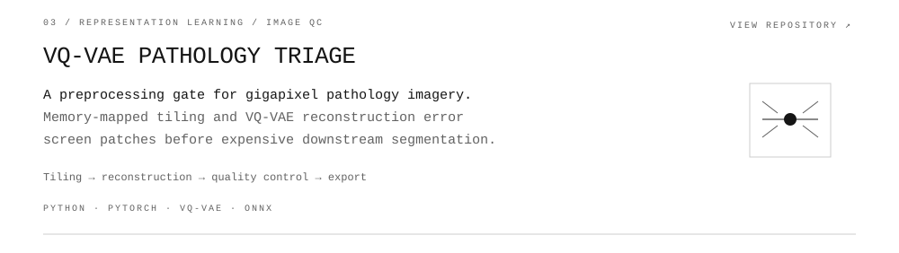</picture></a>

<a href="https://github.com/Snow-Warrior07?tab=repositories">Explore all repositories ↗</a>

<picture><source media="(prefers-color-scheme: dark)" srcset="assets/dark/s04.svg">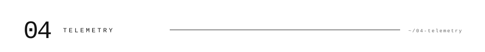</picture>
<picture><source media="(prefers-color-scheme: dark)" srcset="assets/dark/telemetry.svg">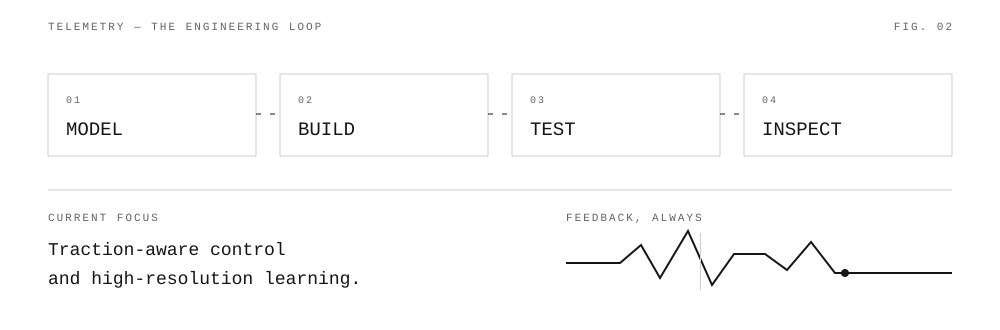</picture>
<picture><source media="(prefers-color-scheme: dark)" srcset="assets/dark/github-stats.svg">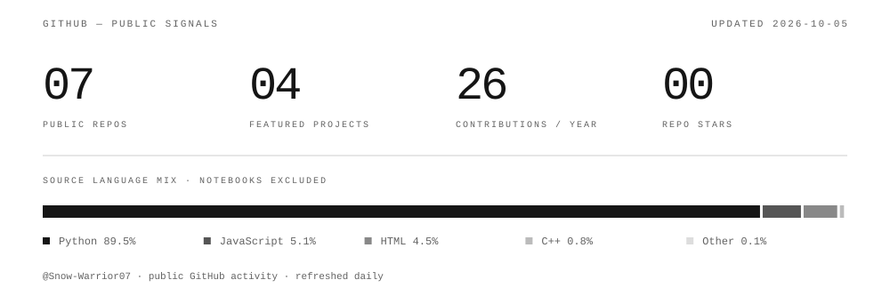</picture>
<picture><source media="(prefers-color-scheme: dark)" srcset="assets/dark/activity.svg">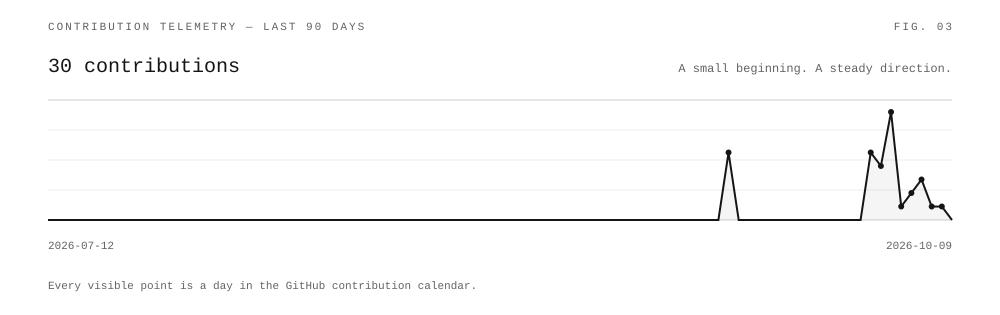</picture>

<picture><source media="(prefers-color-scheme: dark)" srcset="assets/dark/s05.svg">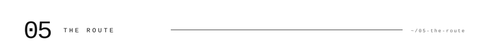</picture>
<picture><source media="(prefers-color-scheme: dark)" srcset="assets/dark/timeline.svg">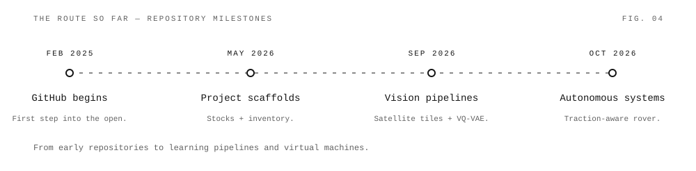</picture>
<picture><source media="(prefers-color-scheme: dark)" srcset="assets/dark/approach.svg">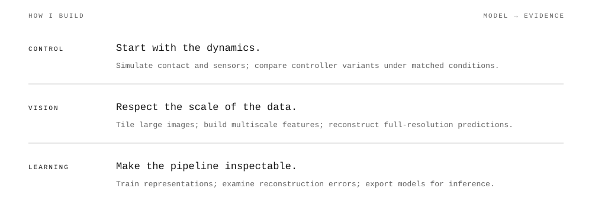</picture>

<picture><source media="(prefers-color-scheme: dark)" srcset="assets/dark/s06.svg">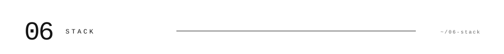</picture>
<picture><source media="(prefers-color-scheme: dark)" srcset="assets/dark/stack.svg">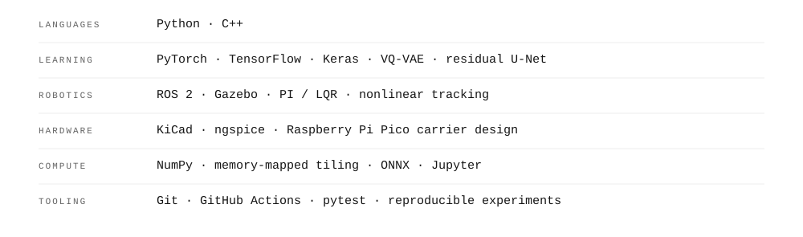</picture>
<picture><source media="(prefers-color-scheme: dark)" srcset="assets/dark/footer.svg">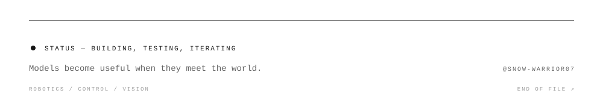</picture>

Text version · project index

**Abhitesh Shukla** — Robotics · Control Systems · Computer Vision.

I build autonomous-system simulations and learning pipelines for high-resolution imagery.

- [TRACTION-AWARE AMR](https://github.com/Snow-Warrior07/traction-aware-amr) — A virtual warehouse rover with friction-limited dynamics, linear and nonlinear tracking, and traction supervision. ROS 2 integration, a Pico carrier PCB, and reproducible tests.
  PYTHON · C++ · ROS 2 · GAZEBO · KICAD
- [SATELLITE TILE SEGMENTATION](https://github.com/Snow-Warrior07/Satellite_based_tile_segmentation) — Pixel-wise segmentation of high-resolution aerial imagery with a residual U-Net and a dilated bottleneck. Patch extraction, test-time augmentation, and tile reconstruction.
  PYTHON · TENSORFLOW · KERAS · JUPYTER
- [VQ-VAE PATHOLOGY TRIAGE](https://github.com/Snow-Warrior07/VAE-Triage) — A preprocessing gate for gigapixel pathology imagery. Memory-mapped tiling and VQ-VAE reconstruction error screen patches before expensive downstream segmentation.
  PYTHON · PYTORCH · VQ-VAE · ONNX

The timeline records public repository milestones. Statistics refresh daily from GitHub. Animated graphics respect reduced-motion preferences.

Visual direction inspired by [Sharann Manojkumar's profile](https://github.com/Sharann-del); graphics and content created for this profile.

